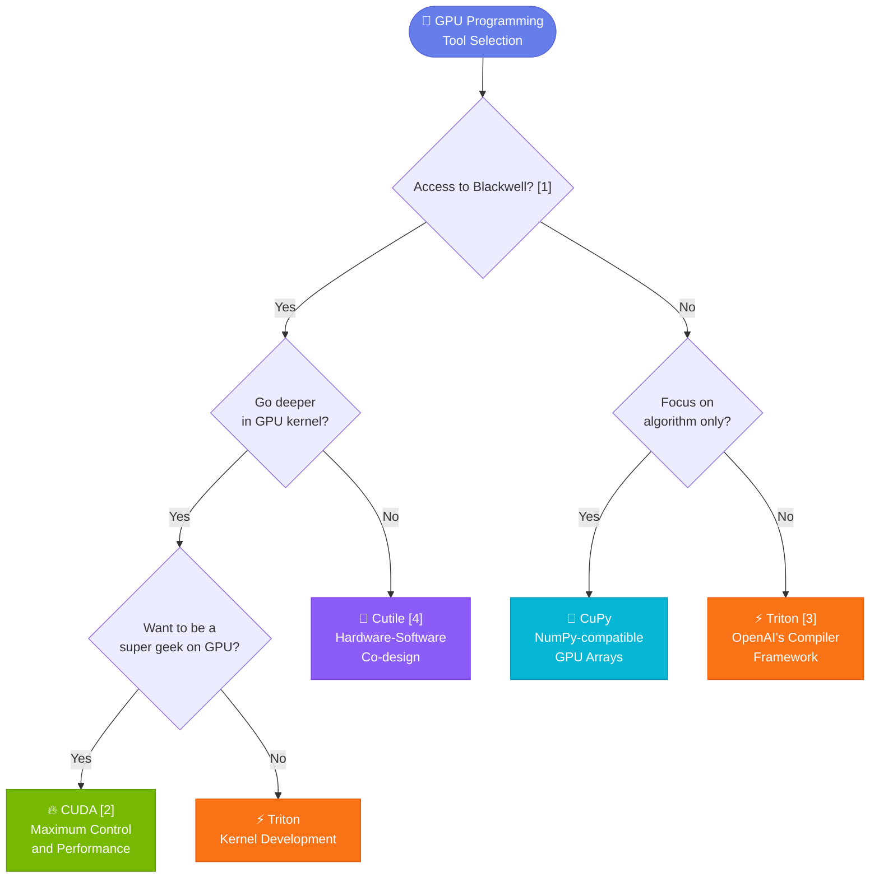

# EDIN MLS 2026 Spring

Welcome to the Machine Learning Systems course at the University of Edinburgh (Spring 2026). This repository contains GPU programming tutorials and assignments designed to teach you how to write efficient GPU kernels for machine learning workloads.

## Quick Start

```bash
# 1. Clone and enter the repository
git clone <repo-url> && cd edin-mls-26-spring

# 2. Set up the conda environment
source utils/setup-env.sh

# 3. Verify your environment
python cutile-tutorial/0-environment/check.py   # For cuTile
python triton-tutorial/0-environment/check.py   # For Triton

# 4. Start with Lesson 1
cd cutile-tutorial/1-vectoradd && python vectoradd.py
```

## Repository Structure

```
edin-mls-26-spring/
├── cutile-tutorial/          # NVIDIA cuTile GPU programming tutorials
│   ├── 0-environment/        # Environment verification
│   ├── 1-vectoradd/          # Lesson 1: Hello World - Vector Addition
│   ├── 2-execution-model/    # Lesson 2: Grid execution patterns (1D/2D)
│   ├── 3-data-model/         # Lesson 3: FP16/FP32 data types
│   ├── 4-transpose/          # Lesson 4: Matrix transpose optimization
│   ├── 5-secret-notes/       # Lesson 5: Advanced optimization notes
│   ├── 6-performance-tuning/ # Lesson 6: Autotuning and profiling
│   ├── 7-attention/          # Lesson 7: Attention mechanism kernels
│   └── *.pdf                 # Course slides
│
├── triton-tutorial/          # OpenAI Triton tutorials (parallel to cuTile)
│   └── (same lesson structure as cutile-tutorial)
│
├── hw1-asr/                  # Homework 1: Automatic Speech Recognition
│   ├── glm_asr_cutile_template/  # YOUR WORK GOES HERE (fill in TODOs)
│   ├── glm_asr_cutile_v1/        # Baseline implementation (~3200ms)
│   ├── glm_asr_cutile_example/   # Reference solution
│   ├── glm_asr_scratch/          # PyTorch CPU reference
│   ├── benchmark.sh              # Performance benchmarking
│   ├── demo.py                   # Interactive Streamlit demo
│   └── test_audio.wav            # Test audio file
│
├── utils/                    # Environment and compatibility tools
│   ├── setup-env.sh          # Main environment setup script
│   └── hack.sh               # Compatibility layer for non-Blackwell GPUs
│
└── requirements-*.lock       # Platform-specific dependency snapshots
```

## Learning Path

Follow this recommended progression:

| Phase | What to Do | Goal |
|-------|------------|------|
| **1. Setup** | Run `source utils/setup-env.sh` | Get your environment working |
| **2. Basics** | Complete Lessons 1-3 in `cutile-tutorial/` | Understand GPU execution model |
| **3. Optimization** | Complete Lessons 4-6 | Learn memory patterns and autotuning |
| **4. Advanced** | Complete Lesson 7 (Attention) | Master complex kernel patterns |
| **5. Application** | Work on `hw1-asr/` | Apply skills to real ML task |

## Tutorial Frameworks

This course covers two GPU programming frameworks with identical lesson structures:

| Framework | Directory | Backend | Best For |
|-----------|-----------|---------|----------|
| **cuTile** | `cutile-tutorial/` | CuPy/CUDA | NVIDIA-specific optimization |
| **Triton** | `triton-tutorial/` | PyTorch | Cross-platform, Python-native |

Start with **cuTile** for the main course content. Use **Triton** if you want to explore an alternative approach or need better cross-GPU portability.

## GPU Compatibility

The tutorials are optimized for NVIDIA Blackwell GPUs but support other architectures:

| GPU Architecture | Support | Notes |
|------------------|---------|-------|
| Blackwell (sm_120) | Native | RTX PRO 6000, full cuTile support |
| Hopper (sm_90) | Via hack.sh | H100, requires compatibility layer |
| Ada (sm_89) | Via hack.sh | RTX 4090, requires compatibility layer |
| Ampere (sm_80) | Via hack.sh | A100/RTX 30xx, requires compatibility layer |

If you want to try Cutil on non-Blackwell GPUs, run the compatibility script before executing cuTile code:
```bash
source utils/hack.sh
```

## Choosing the Right GPU Programming Tool

Before diving into the homework, it's worth understanding where the tools we teach fit in the broader GPU programming landscape.



### Tool Comparison

| **Tool** | **Difficulty** | **Performance Control** | **Best For** |
|----------|----------------|-------------------------|--------------|
| **CUDA** | ⭐⭐⭐⭐⭐ | Ultimate | Deep optimization, Nvidia careers |
| **Triton** | ⭐⭐⭐ | High | Rapid prototyping, research |
| **Cutile** | ⭐⭐ | High | Hardware-software co-design |
| **CuPy** | ⭐ | Medium | NumPy users, quick migration |

### Notes & References

**[1] Blackwell GPU Access** — If you need access to Nvidia's Blackwell architecture, the most budget-friendly option is the RTX 5060 available through [vast.ai](http://vast.ai), priced at just $0.10 per hour. This makes it an accessible choice for students and researchers who want to experiment with Cutile without significant upfront costs.

**[2] CUDA Career Path** — Mastering CUDA is a strong pathway to a career at Nvidia. If you're interested in pursuing this route, this guide provides a detailed blueprint for landing an entry-level position: [How to Get Hired at Nvidia in 2026](https://example.com/nvidia-hiring-guide)

**[3] Triton at OpenAI** — OpenAI is actively hiring software engineers to work on the Triton compiler, which signals the growing importance of Triton in production ML infrastructure. If you're proficient in Triton, this could be a compelling career opportunity: [Software Engineer, Triton Compiler](https://openai.com/careers/software-engineer-triton-compiler-san-francisco/)

**[4] Why Cutile?** — Cutile offers a balanced approach for those interested in hardware-software co-design. It provides more control than high-level frameworks like CuPy, while being more approachable than writing raw CUDA kernels. This makes it ideal for developers who want to optimize performance without getting lost in low-level details.

---

## Homework 1: Automatic Speech Recognition

The `hw1-asr/` directory contains a hands-on assignment implementing GPU-accelerated speech recognition:

```
hw1-asr/
├── glm_asr_cutile_template/  # Start here - fill in the TODOs
├── glm_asr_cutile_v1/        # Baseline to beat (~3200ms)
├── glm_asr_cutile_example/   # Reference (don't peek until you try!)
└── glm_asr_scratch/          # PyTorch CPU version for understanding
```

**Key files in each implementation:**
- `layers.py` - Linear, LayerNorm, MLP, Embedding layers
- `attention.py` - Multi-head attention mechanism
- `flash_attention.py` - FlashAttention optimization
- `rope.py` - Rotary Position Embedding
- `model.py` - Full ASR model architecture

See [`hw1-asr/README.md`](hw1-asr/README.md) for detailed assignment instructions.

## Requirements Lock Files

The `requirements-*.lock` files are platform-specific dependency snapshots:

- `requirements-blackwell.lock` - NVIDIA Blackwell GPU (RTX PRO 6000, sm_120)
- `requirements-hopper.lock` - NVIDIA Hopper GPU (if available)

These are generated by `conda list --export` and vary across GPU architectures. Use the setup script for automatic configuration.

## Resources

- **Course Slides**: `cutile-tutorial/Modern GPU Programming 2026-0123.pdf`
- **Each lesson has its own README** with detailed explanations
- **Benchmark your progress**: `cd hw1-asr && bash benchmark.sh`

## Troubleshooting

| Issue | Solution |
|-------|----------|
| Environment setup fails | Check conda ToS accepted: `conda tos accept` |
| cuTile import errors | Run `source utils/hack.sh` for non-Blackwell GPUs |
| CUDA out of memory | Reduce batch size or restart Python kernel |
| Kernel compilation slow | First run compiles; subsequent runs are cached |

## License

Apache 2.0 - See [LICENSE](LICENSE) for details.
